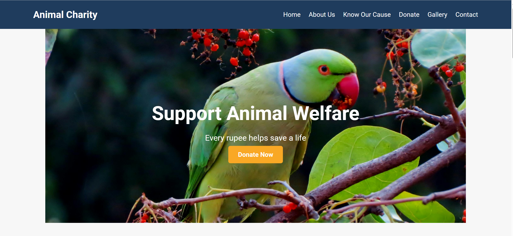
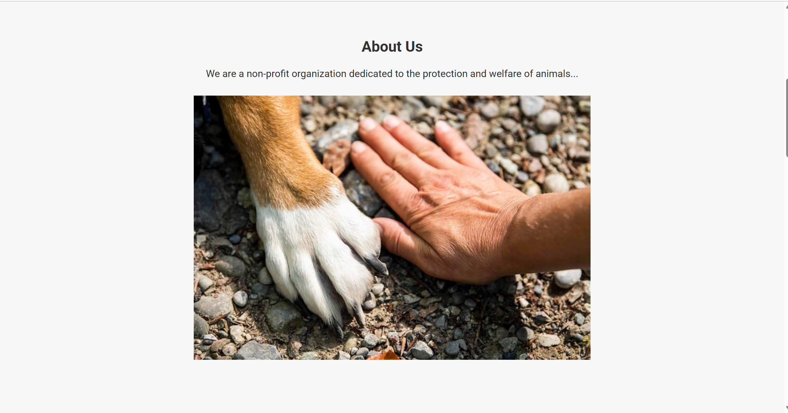
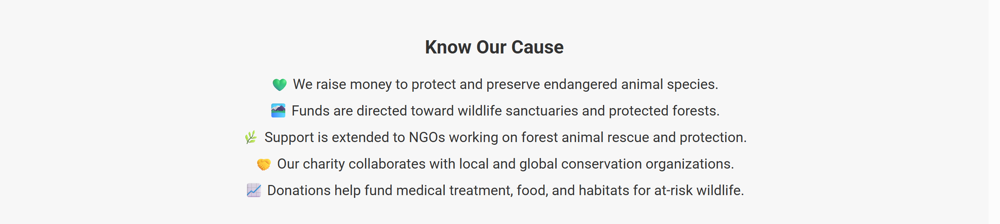
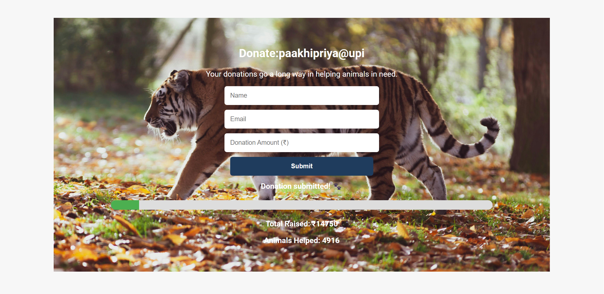
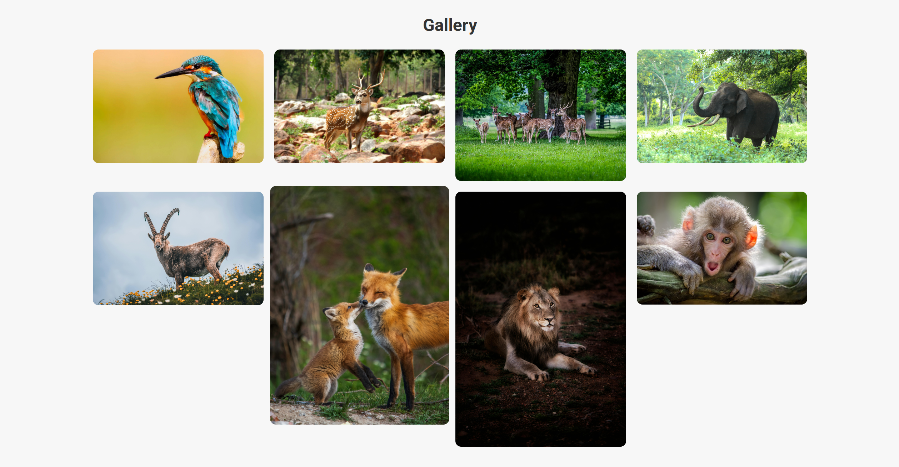
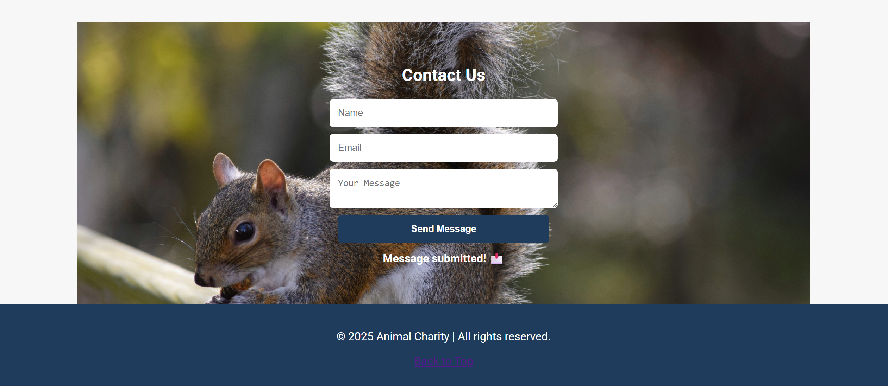
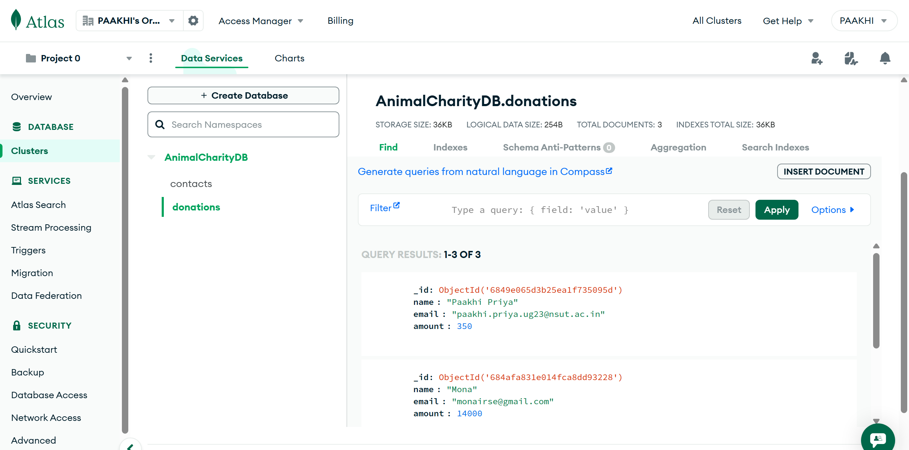
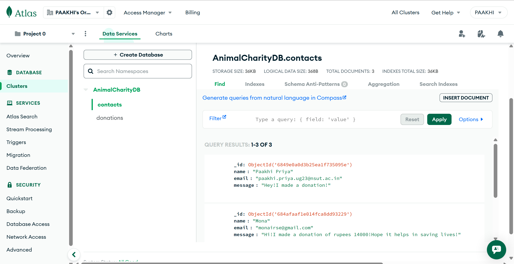

# Animal Charity Website

A full-stack web application built to promote animal welfare and help raise funds for endangered species. This platform enables users to donate, spread awareness, and connect with the cause through an interactive, responsive interface backed by a live database.

---

## Live Demo

[Click here to view the live site](https://your-deployment-url.com)

---

## Summary

This project offers a seamless interface for animal lovers and supporters to contribute to conservation efforts. Built with HTML, CSS, JavaScript, Node.js, Express, and MongoDB, the site is optimized for performance, accessibility, and real-world usability.

---

## Problem Statement

Many animal welfare organizations lack a strong digital presence and tools to facilitate real-time donations and data collection. Without such platforms, it's hard to reach modern-day donors or share transparent progress updates.

---

## Solution Approach

The Animal Charity website solves this by offering:
- A visually engaging frontend to tell the charity’s story
- Real-time donation tracking connected to MongoDB
- A clean UI for donors to contribute and send messages
- Persistent backend logic to store donor and contact data
- A donation goal progress bar and animal impact estimator
- UPI option for Indian donors and a contact form for outreach

---

## Tech Stack

| Component       | Technology Used               |
|-----------------|-------------------------------|
| Frontend        | HTML5, CSS3, JavaScript       |
| Styling         | Google Fonts (Roboto), CSS    |
| Backend         | Node.js, Express.js           |
| Database        | MongoDB Atlas (Cloud DB)      |
| Deployment      | Render (or Vercel)            |
| Version Control | Git & GitHub                  |

---

## Features of the Project

- Responsive layout for all screen sizes  
- Automatic image carousel on homepage  
- Live donation tracker with animated progress bar  
- Real-time animal impact estimation  
- Donation form with validation and storage  
- Contact form with live confirmation  
- Persistent backend (MongoDB) storing form data  
- Interactive image gallery with hover effects  

---

## Future Improvements

- Integrate Razorpay or UPI QR for live payments  
- Admin dashboard to manage donations  
- Email confirmations for form submissions  
- Custom domain and SSL certification  
- Donor leaderboard or testimonials section  
- Wildlife campaign blog or news feed  
- SEO optimization and analytics tracking  

---

## Output Screenshots

All screenshots are saved in the `/screenshots` directory.

### Homepage (with auto carousel)


### About Us Section


### Know Our Cause Section


### Donation Section (Live counter & form)


### Gallery of Animal Images


### Contact Us Section


### MongoDB - Donations Collection


### MongoDB - Contact Messages


---

## How to Run Locally

### Prerequisites

- Node.js must be installed
- A MongoDB Atlas cluster with IP whitelisting and a database

---

### Steps

1. **Clone the repository**
   - Open a terminal or command prompt and run:
     ```bash
     git clone https://github.com/your-username/animal-charity-website.git
     cd animal-charity-website
     ```

2. **Install dependencies**
   - This will install all required Node modules:
     ```bash
     npm install
     ```

3. **Create a `.env` file in the root directory**
   - Paste your MongoDB URI inside it like this:
     ```
     MONGODB_URI=your-mongodb-connection-uri
     ```

4. **Start the server**
   - Run the backend with:
     ```bash
     node server.js
     ```

5. **Open the site in your browser**
   - Visit:
     ```
     http://localhost:3000
     ```

> 

---


## License

All images are used from free stock platforms like Unsplash and Pexels.
